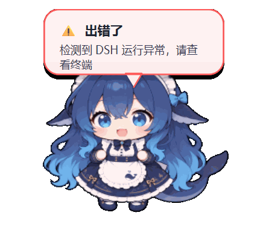
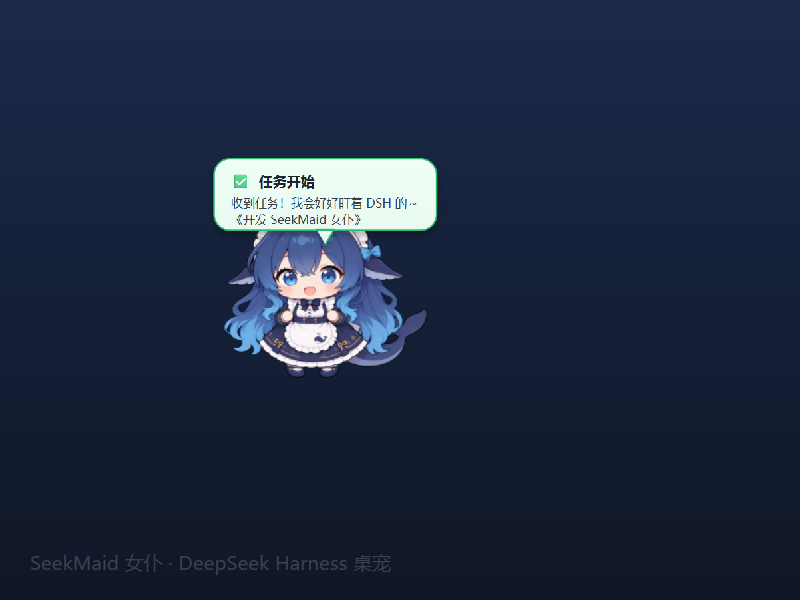
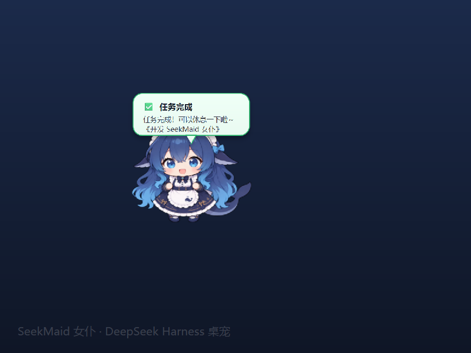
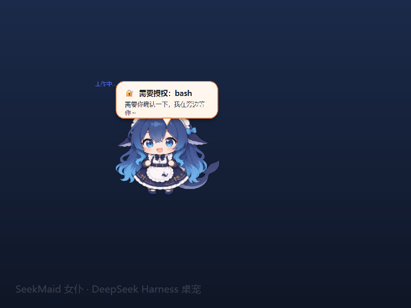
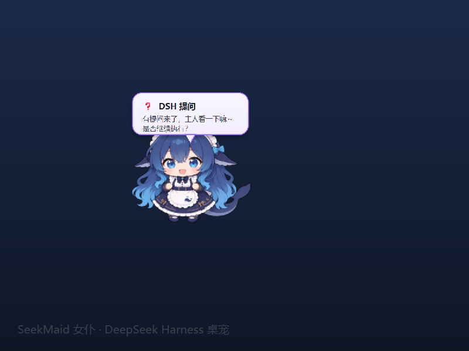

# SeekMaid 女仆（DeepSeek 娘桌宠）

一个运行在 Windows 11 上的可爱桌面宠物。使用你提供的 DEEPSEEK 娘形象，
常驻桌面/系统托盘，并连接本机 DSH（DeepSeek Harness）终端：

- 监控 DSH 会话状态：任务开始、任务完成、新消息、工具调用、任务清单变化时，桌宠会用气泡提示你。
- 双向通信：双击桌宠或右键菜单，可以直接给当前 DSH 会话发送消息；DSH 的回复会出现在桌宠气泡里。
- 长久运行：无控制台窗口（`pythonw`）、单实例、关闭窗口只隐藏到托盘、可设置开机自启。
- DSH 插件模式：这个目录本身也是一个 DSH 插件包，DSH 启动时自动拉起桌宠，DSH 停止时自动关闭桌宠。

## 架构说明：WSL + Windows 11

本项目设计为：

```text
WSL 内运行 DSH（DeepSeek Harness）
        │
        │  localhost:3080
        ▼
Windows 11 原生运行 SeekMaid 女仆桌宠（PySide6）
```

- **DSH 跑在 WSL 里**：提供 API / WebSocket，桌宠从这里获取任务状态、授权、QA 等事件。
- **桌宠跑在 Windows 11 原生侧**：不走 WSLg，所以窗口置顶、任务栏图标、拖动、提示音都更稳定。
- **通信**：Windows 通过 `http://localhost:3080` 访问 WSL 里的 DSH（WSL2 自动转发 localhost）。

> 如果你的 DSH 直接跑在 Windows 上，也可以使用同一套代码，`dsh_url` 保持 `http://localhost:3080` 即可。

## 效果预览

**待机动画**



**任务开始**



**任务完成**



**需要授权**



**DSH 提问**



**出错提示**


## 克隆后能否直接获得同等能力？

**基本可以，但不是“克隆完立刻就能用”**，需要几步初始化：

1. 在 Windows 侧克隆本仓库。
2. 运行 `setup_windows.bat`：自动创建 `.venv` 并安装 PySide6。
3. 运行 `run_pet.bat`：即可手动启动 Windows 原生桌宠。
4. 如果希望 DSH 启动时自动拉起桌宠：
   - 在 WSL 的 DSH 中安装本插件；
   - 插件会自动检测/复制 Windows 项目并自动初始化（零配置模式）；
   - 如果路径不同，可在插件配置里把 `windowsProject` 指向你 Windows 侧的仓库路径；
   - 重启 DSH。

仓库不会包含以下本地环境内容（已在 `.gitignore` 中排除）：

- `.venv/`：每个人的 Python 虚拟环境不同
- `wslg-xcb-libs/`：WSLg 本地运行库
- `*.log`：运行日志
- `__pycache__/`：Python 缓存

所以别人克隆后，需要先执行初始化脚本，才能获得和当前一样的桌宠能力。

## 项目结构

```text
seekmaid-pet/
├── deepseek_pet.py          # Windows 原生桌宠主程序（PySide6）
├── dsh_client.py            # DSH API 客户端
├── dsh_monitor.py           # DSH 任务监控 + WebSocket 事件
├── src/index.js             # DSH 插件 host 端：自动部署 + 启动桌宠
├── cordis.patch.yml         # DSH 插件注册补丁
├── package.json             # DSH 插件包元数据
├── setup_windows.bat        # Windows 一键初始化（venv + PySide6）
├── run_pet.bat              # Windows 启动桌宠
├── install_plugin.bat/.sh   # DSH 插件安装脚本
├── AI.md                    # 给 AI 代理的部署指南
├── README.md
└── assets/
    ├── deepseek_girl.png    # DeepSeek 娘立绘
    ├── deepseek_girl.ico    # 任务栏/托盘图标
    ├── deepseek_sprite.png  # 精灵图素材（预留）
    └── notify.wav           # 自定义提示音
```

## DSH 插件安装（推荐）

这个项目同时是一个 DSH 插件，包名 `seekmaid-pet`。安装后，DSH 每次启动都会自动启动桌宠；DSH 退出时也会自动关闭桌宠。

```sh
# 在项目目录里执行
dsh plugin --profile web add "file:$(pwd)"
```

也可以直接运行项目里的安装脚本：

```bat
:: Windows
install_plugin.bat
```

```sh
# Linux / macOS
./install_plugin.sh
```

如果 `dsh plugin` 不可用，也可以手动接线：

```sh
# 1) 让 DSH 能解析到插件（在项目目录里执行）
ln -sfn "$(pwd)" "$DSH_HOME/../dsh/node_modules/seekmaid-pet"

# 2) 在 profile patch 里注册
#    编辑 ~/.dsh/profiles/web/cordis.patch.yml，追加：
#    - insert:
#        - id: seekmaid
#          name: 'seekmaid-pet'
```

然后重启 DSH。

> 插件默认使用 `pythonw`（Windows）或 `python3`（其他平台）启动桌宠。
> 如果 Python 不在 PATH，可以在插件配置里指定 `python` 路径。
>
> 注意：如果 DSH 跑在 WSL/远程 Linux，而桌宠要显示在 Windows 桌面，插件需要装在 Windows 侧的 DSH 上，Linux 侧无法直接拉起 Windows GUI。

### 插件配置示例

```yaml
- id: seekmaid
  name: 'seekmaid-pet'
  config:
    enabled: true
    windowsProject: C:\Users\<你的用户名>\seekmaid-pet   # Windows 侧项目路径
    python: C:\Users\<你的用户名>\seekmaid-pet\.venv\Scripts\pythonw.exe
    script: C:\Users\<你的用户名>\seekmaid-pet\deepseek_pet.py
    startupTimeoutMinutes: 3   # 可选，覆盖桌宠的 3 分钟自动退出机制
```

> `windowsProject` 是 WSL 里的 DSH 插件去拉起 Windows 原生桌宠时使用的路径。
> 插件默认会自动猜测 `C:\Users\<当前WSL用户名>\seekmaid-pet`，如果你的路径不同，请显式配置。

## 兼容性

| 项目 | 要求 |
|---|---|
| Windows | Windows 11（10 也可尝试） |
| Python | 3.10+（Windows 侧） |
| DSH | DeepSeek Harness ≥ 0.1.0-rc.6 |
| DSH 运行位置 | WSL / Linux（推荐）或 Windows 原生 |
| 网络 | Windows 可访问 `http://localhost:3080` |

## 界面与操作

| 操作 | 效果 |
|---|---|
| 左键拖拽 | 移动桌宠 |
| 双击桌宠 | 给 DSH 发送消息 |
| 右键桌宠 | 发送消息 / 打开 DSH 网页 / 退出 |
| 系统托盘图标 | 显示/隐藏、开机自启、退出 |

## 安装与运行（Windows 侧）

如果你从 GitHub 克隆到 Windows，想直接获得同等桌宠能力：

1. 安装 Python 3.10+（勾选 **Add python.exe to PATH**）。
2. 在项目目录运行一键初始化：

   ```bat
   setup_windows.bat
   ```

   它会自动创建 `.venv` 并安装 PySide6。

3. 启动桌宠：

   ```bat
   run_pet.bat
   ```

   或者手动：

   ```bat
   .venv\Scripts\pythonw.exe deepseek_pet.py
   ```

> 如果 DSH 跑在 WSL，Windows 侧桌宠通过 `http://localhost:3080` 连接，无需额外配置。

## 连接 DSH

桌宠默认连接 `http://localhost:3080`（本机 DSH Web 服务，WSL2 下会自动转发到 WSL）。
如果 DSH 地址不同，编辑同目录下的 `config.json`：

```json
{
  "dsh_url": "http://localhost:3080",
  "session_id": "",
  "poll_interval": 3
}
```

- `session_id` 留空时，桌宠会自动选择最新/正在运行的会话。
- 也可以填具体的 `session-xxxx` 来固定监控某个会话。

## 配置文件说明

`config.json` 首次运行后会自动生成，可用字段：

| 字段 | 默认 | 说明 |
|---|---|---|
| `dsh_url` | `http://localhost:3080` | DSH Web 服务地址 |
| `session_id` | `""` | 要监控/通信的会话；留空自动选择 |
| `poll_interval` | `3` | 轮询 DSH 的间隔（秒） |
| `scale` | `1.0` | 桌宠缩放倍数 |
| `notify_on_start` | `true` | 任务开始时提示 |
| `notify_on_finish` | `true` | 任务完成时提示 |
| `notify_on_message` | `true` | 新用户/助手消息时提示 |
| `notify_on_tool` | `false` | 工具调用时提示（较频繁） |
| `notify_on_todos` | `true` | 任务清单变化时提示 |
| `notify_on_status` | `false` | 开始/结束等状态提示 |
| `notify_sound` | `true` | 是否播放自定义音乐提示音 |
| `notify_duration_user_ms` | `8000` | 用户消息提示停留时间（毫秒） |
| `notify_duration_assistant_ms` | `15000` | DeepSeek 回复提示停留时间（毫秒） |
| `notify_duration_start_ms` | `8000` | 任务开始提示停留时间（毫秒） |
| `notify_duration_finish_ms` | `12000` | 任务完成提示停留时间（毫秒） |
| `startup_timeout_minutes` | `3` | 启动后若 DSH 在 N 分钟内不可达，桌宠自动退出 |
| `position` | `{x,y}` | 上次关闭时的窗口位置 |

## 开机自启

- 在系统托盘图标的右键菜单里勾选 **开机自启**。
- 或者手动运行：

  ```bat
  reg add "HKCU\Software\Microsoft\Windows\CurrentVersion\Run" /v SeekMaidPet /t REG_SZ /d "\"<pythonw路径>\" \"<本目录>\deepseek_pet.py\"" /f
  ```

## 常见问题

- **桌宠是白底方块？**  
  首次启动会自动把图片边缘的浅色背景做透明化处理。如果原图背景不是纯色/浅色，
  可以自己用工具把图片导出为透明 PNG，替换 `assets/deepseek_girl.png`。

- **连不上 DSH？**  
  先确认 DSH Web 已启动并能打开 `http://localhost:3080`。如果 DSH 在 WSL/远程，
  把 `dsh_url` 改成对应的地址。

- **不想看到工具调用提示？**  
  把 `config.json` 里的 `notify_on_tool` 改为 `false`。

- **桌宠启动后会自动退出？**  
  默认机制是：启动后 3 分钟内如果连不上 DSH，会自动关闭（避免误开一个没有用的桌宠）。
  如果 DSH 启动较慢，把 `config.json` 里的 `startup_timeout_minutes` 调大。
